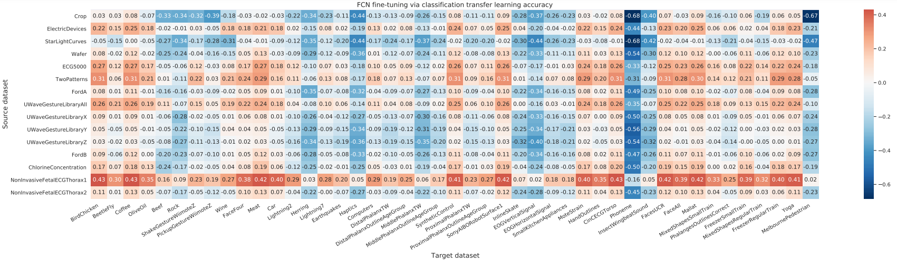
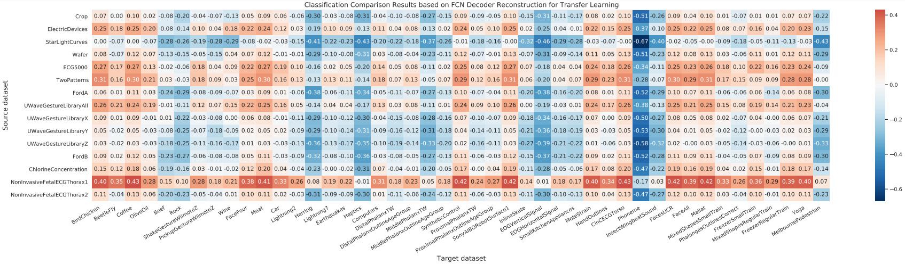
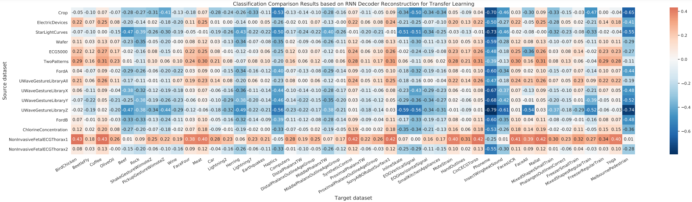

# From Transfer to Transformer

This is the training code for our paper *"From Transfer to Transformer: A Survey on
Time-series Pre-Training Models"*

## Data
The datasets used in this project are as follows:
* [128 UCR datasets](https://www.cs.ucr.edu/~eamonn/time_series_data_2018/UCRArchive_2018.zip)
* [30 UEA datasets](http://www.timeseriesclassification.com/Downloads/Archives/Multivariate2018_arff.zip)
* [ETDataset](https://archive.ics.uci.edu/ml/datasets/ElectricityLoadDiagrams20112014)
* [Electricity](https://archive.ics.uci.edu/ml/datasets/ElectricityLoadDiagrams20112014)
* [Yahoo dataset](https://webscope.sandbox.yahoo.com/catalog.php?datatype=s&did=70) 
* [KPI dataset](http://test-10056879.file.myqcloud.com/10056879/test/20180524_78431960010324/KPI%E5%BC%82%E5%B8%B8%E6%A3%80%E6%B5%8B%E5%86%B3%E8%B5%9B%E6%95%B0%E6%8D%AE%E9%9B%86.zip)


## Usage (Transfer Learning)
1. To pre-train a model on your own dataset, run

```bash
python train.py --dataroot [your UCR datasets directory] --task [type of pre-training task: classification or reconstruction] --dataset [name of the dataset you want to pretrain on] --backbone [fcn or dilated] --mode pretrain ...
```

2. To finetune (classification) the model on a dataset, run

```bash
python train.py --dataroot [your UCR datasets directory] --dataset [name of the dataset you want to finetune on] --source_dataset [the dataset you pretrained on] --save_dir [the directory to save the pretrained weights] --mode finetune ...

```

run 
```bash 
python train.py -h
```

For detailed options and examples, please refer to ```scripts/transfer_pretrain_finetune.sh```

## Usage (Transformer and Contrastive Learning)
|  ID   | Method  | Architecture | Year | Press. | Source Code |
|  ----  | ----  | ----  | ----  | ----  | ---- | 
| 1  | [TS2Vec](https://www.aaai.org/AAAI22Papers/AAAI-8809.YueZ.pdf) | Contrastive Learning |2022 | AAAI | [github-link](https://github.com/yuezhihan/ts2vec) |
| 2  | [TS-TCC](https://www.ijcai.org/proceedings/2021/0324.pdf) | Contrastive Learning & Transformer | 2021 | IJCAI | [github-link](https://github.com/emadeldeen24/TS-TCC) |
| 3  | [TST](https://dl.acm.org/doi/10.1145/3447548.3467401) | Transformer | 2021 | KDD | [github-link](https://github.com/gzerveas/mvts_transformer) |
| 4  | [Triplet-loss](https://papers.nips.cc/paper/2019/hash/53c6de78244e9f528eb3e1cda69699bb-Abstract.html) | Contrastive Learning | 2019 | NeurIPS | [github-link](https://github.com/White-Link/UnsupervisedScalableRepresentationLearningTimeSeries) |
| 5  | [TNC](https://dl.acm.org/doi/10.1145/3447548.3467401) | Contrastive Learning | 2021 | ICLR | [github-link](https://github.com/sanatonek/TNC_representation_learning) |
| 6  | [SelfTime](https://openreview.net/pdf?id=qFQTP00Q0kp) | Contrastive Learning | 2021 | Submitted to ICLR | [github-link](https://github.com/haoyfan/SelfTime) |


1. Pre-training and classification using **TS2Vec** model on a UCR dataset, run
```bash 
python train_tsm.py --dataroot [your UCR datasets directory] --normalize_way single ...
```

For detailed options and examples, please refer to ```ts2vec_cls/scripts/ts2vec_tsm_single_norm.sh```

2. Pre-training and classification using **TS-TCC** model on a UCR dataset, run
```bash 
python main_ucr.py --dataset [name of the ucr dataset] --device cuda:0 --save_csv_name tstcc_ucr_ --seed 42;
```

For detailed options and examples, please refer to ```tstcc_cls/scripts/fivefold_tstcc_ucr.sh```

3. To pre-train and classification using **TST** model on a UCR dataset, run
```bash 
python src/main.py --dataset [dataset name] --data_dir [path of the dataset] --batch_size [batch size] --task pretrain_and_finetune --epochs
```

To do classification task using Transformer encoder on a UCR dataset, run
```bash
python src/main.py --dataset [dataset name] --data_dir [path of the dataset] --batch_size [batch size] --task classification --epochs
```

For detailed options and examples for training on the full UCR128 dataset, please refer to ```tst_cls/scripts/pretrain_finetune.sh``` and ```tst_cls/scripts/classification.sh```or simply run 
```bash
python src/main.py -h
```

4. Pre-training and classification using **Triplet-loss** model on a UCR dataset, run
```bash 
python ucr.py --dataset [name of the ucr dataset] --path [your UCR datasets directory] --hyper [hyperparameters file path(./default_hyperparameters.json for default option)] --cuda
```

For detailed options and examples, please refer to ```tloss_cls/scripts/ucr.sh```

Pre-training and classification using **Triplet-loss** model on a UEA dataset, run
```bash 
python uea.py --dataset [name of the uea dataset] --path [your UEA datasets directory] --hyper [hyperparameters file path(./default_hyperparameters.json for default option)] --cuda
```

For detailed options and examples, please refer to ```tloss_cls/scripts/uea.sh```


5. Pre-training and classification using **SelfTime** model on a UCR dataset, run
```bash
python -u train_ssl.py --dataset_name [dataset name] --model_name SelfTime --ucr_path [your UCR datasets directory] --random_seed 42
```

For detailed options and examples, please refer to ```selftime_cls/scripts/ucr.sh```

## Usage (Visualization)
* To get the visualization of model's feature map, run
```bash
python visualize.py --dataroot [your dataset root] --dataset [dataset name] --backbone [encoder backbone] --graph [cam, heatmap or tsne] 
```
* We provide weights of Wine and GunPoint dataset for quick start. 

## Results
### Transfer learning in UCR datasets






