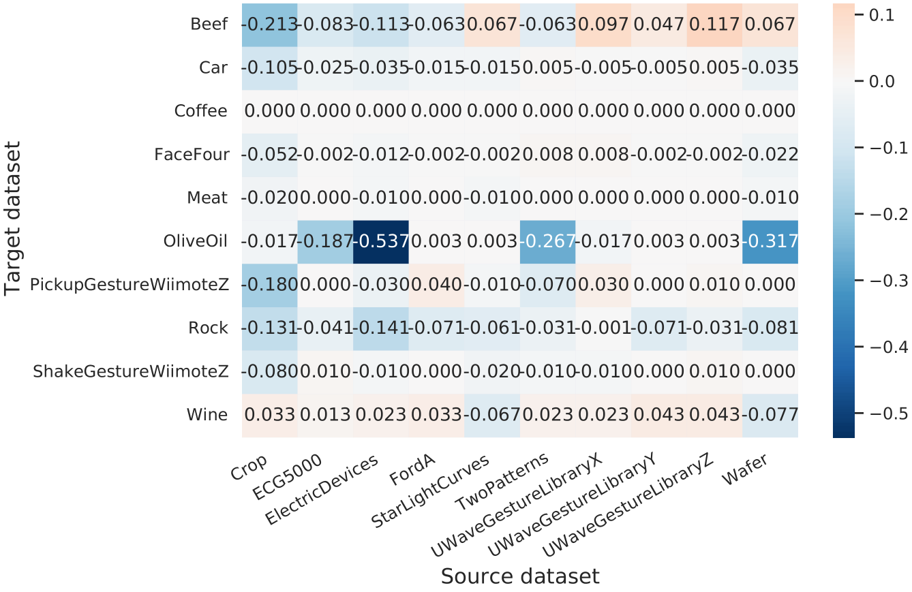

# From Transfer to Transformer

This is the training code for our paper *"From Transfer to Transformer: A Survey on
Pre-Training Time-series Models"*


## Usage
1. To pretrain a model on your own dataset, run

```bash
python train.py --dataroot [your UCR datasets directory] --dataset [name of the dataset you want to pretrain on] --backbone [fcn or dilated] --mode pretrain ...
```

2. To finetune the model on a dataset, run

```bash
python train.py --dataroot [your UCR datasets directory] --dataset [name of the dataset you want to finetune on] --source_dataset [the dataset you pretrained on] --save_dir [the directory to save the pretrained weights] --mode finetune ...

```

run 
```bash 
python train.py -h
```
for detailed options

## Results
### Transfer learning in UCR datasets



<p align="center">*FCN and FCN-RNN fine-tuning accuracy*</p>


<center>Dilated-3 CNN and  Dilated-3 CNN-RNN fine-tuning accuracy</center>