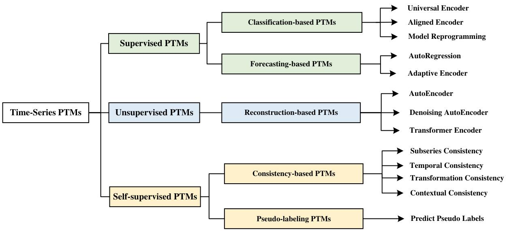

# A Survey on Time-Series Pre-Trained Models

This is the training code for our paper *"A Survey on Time-Series Pre-Trained Models"*

## Overview

Time-Series Mining (TSM) is an important research area since it shows great potential in practical applications. Deep learning models that rely on massive labeled data have been utilized for TSM successfully. However, constructing a large-scale well-labeled dataset is difficult due to data annotation costs. 
Recently, pre-trained models have gradually attracted attention in the time series domain due to their remarkable performance in computer vision and natural language processing. In this survey, we provide a comprehensive review of Time-Series Pre-Trained Models (TS-PTMs), aiming to guide the understanding, applying, and studying TS-PTMs. 
Specifically, we first briefly introduce the typical deep learning models employed in TSM. Then, we give an overview of TS-PTMs according to the pre-training techniques. The main categories we explore include supervised, unsupervised, and self-supervised TS-PTMs.
Further, extensive experiments involving  27 methods, 434 datasets, and 679 transfer learning scenarios are conducted to analyze the advantages and disadvantages of transfer learning strategies, Transformer-based models, and representative TS-PTMs. Finally, we point out some potential directions of TS-PTMs for future work.

    

## Datasets
The datasets used in this project are as follows:
### Time-Series Classification
* [128 UCR datasets](https://www.cs.ucr.edu/~eamonn/time_series_data_2018/UCRArchive_2018.zip)
* [30 UEA datasets](http://www.timeseriesclassification.com/Downloads/Archives/Multivariate2018_arff.zip)
* [SleepEEG dataset](https://www.physionet.org/content/sleep-edfx/1.0.0/) 
* [Epilepsy dataset](https://repositori.upf.edu/handle/10230/42894) 
* [FD-A and FD-B datasets](https://mb.uni-paderborn.de/en/kat/main-research/datacenter/bearing-datacenter/data-sets-and-download) 
* [HAR dataset](https://archive.ics.uci.edu/ml/datasets/Human+Activity+Recognition+Using+Smartphones) 
* [Gesture dataset](http://www.timeseriesclassification.com/description.php?Dataset=UWaveGestureLibrary) 
* [ECG dataset](https://physionet.org/content/challenge-2017/1.0.0/) 
* [EMG dataset](https://physionet.org/content/emgdb/1.0.0/) 

### Time-Series Forecasting
* [ETDataset (including 4 datasets)](https://archive.ics.uci.edu/ml/datasets/ElectricityLoadDiagrams20112014)
* [Electricity](https://archive.ics.uci.edu/ml/datasets/ElectricityLoadDiagrams20112014)
* [Traffic](http://pems.dot.ca.gov)
* [Weather](https://www.bgc-jena.mpg.de/wetter)
* [Exchange](https://github.com/laiguokun/multivariate-time-series-data)
* [ILI](https://gis.cdc.gov/grasp/fluview/fluportaldashboard.html)

### Time-Series Anomaly Detection
* [Yahoo dataset](https://webscope.sandbox.yahoo.com/catalog.php?datatype=s&did=70) 
* [KPI dataset](http://test-10056879.file.myqcloud.com/10056879/test/20180524_78431960010324/KPI%E5%BC%82%E5%B8%B8%E6%A3%80%E6%B5%8B%E5%86%B3%E8%B5%9B%E6%95%B0%E6%8D%AE%E9%9B%86.zip)
* [250 UCR anomaly detection datasets](https://wu.renjie.im/research/anomaly-benchmarks-are-flawed/#ucr-time-series-anomaly-archiv) 
* [MSL dataset](https://github.com/khundman/telemanom) 
* [SMAP dataset](https://github.com/eBay/RANSynCoders) 
* [PSM dataset](https://github.com/khundman/telemanom) 
* [SMD dataset](https://github.com/NetManAIOps/OmniAnomaly) 
* [SWaT dataset](https://itrust.sutd.edu.sg/itrust-labs_datasets/dataset_info/#swat) 
* [NIPS-TS-SWAN dataset](https://github.com/datamllab/tods/tree/benchmark/benchmark) 
* [NIPS-TS-GECCO dataset](https://github.com/datamllab/tods/tree/benchmark/benchmark) 

## Pre-Trained Models on Time Series Forecasting
For details, please refer to [ts_classification_methods/README](https://github.com/qianlima-lab/time-series-ptms/blob/master/ts_classification_methods/README.md).

## Pre-Trained Models on Time Series Forecasting
For details, please refer to [ts_forecating_methods/README](https://github.com/qianlima-lab/transfer-to-transformer-tsm/blob/master/ts_forecasting_methods/README.md).

## Pre-Trained Models on Time Series Anomaly Detection
For details, please refer to [ts_anomaly_detection_methods/README](https://github.com/qianlima-lab/transfer-to-transformer-tsm/blob/master/ts_anomaly_detection_methods/README.md).